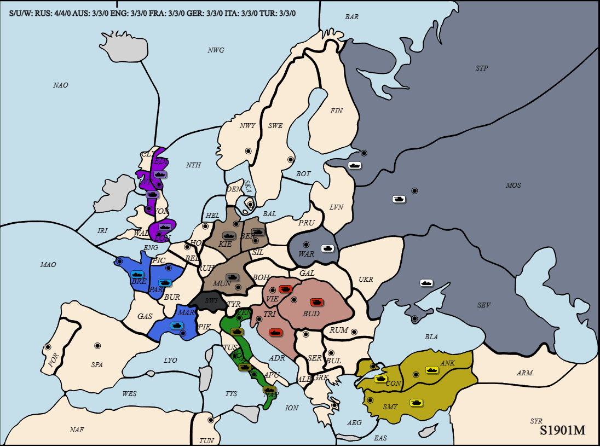

# Welfare Diplomacy: Benchmarking Autonomous Language Model Cooperation

Implementation of Welfare Diplomacy (a novel variant of the board game Diplomacy), language model scaffolding to build competent baseline agents, experiment runner harness and sweep setups, collected data, and figure graphing scripts. Originally forked from https://github.com/diplomacy/diplomacy.

<!-- TODO better gif of exploitation game -->

<p align="center">
  
</p>

## Repository Structure

The important locations are are:
- [`diplomacy`](./diplomacy): A Python Diplomacy engine (modified from https://github.com/diplomacy/diplomacy to support the Welfare Diplomacy variant).
- [`experiments`](./experiments/): Scaffolding to get zero-shot prompted language models to play Diplomacy or Welfare Diplomacy.
- [`experiments/charts`](./experiments/charts): Plotting code and outputted plots.
- [`experiments/gifs`](./experiments/gifs): Saved animated GIFs of a few games.
- [`experiments/manual_orders`](./experiments/manual_orders): Hard-coded listed of orders to simulate when using the `manual` agent. 
- [`experiments/results`](./experiments/results): CSV files of results from our experiments (used to create the charts).
- [`experiments/sweeps`](./experiments/sweeps): [Weights & Biases](https://wandb.ai/) sweep configs used to run our experiments.
- [`experiments/agents.py`](./experiments/agents.py): 
- [`experiments/backends.py`](./experiments/backends.py): 
- [`experiments/prompts.py`](./experiments/prompts.py): 
- [`experiments/simulate_game.py`](./experiments/simulate_game.py): 

## Running Same-Policy Experiments

To run our agents with our scaffolding in the `experiments` folder in same-policy games, do the following steps:

0. Clone the repo with submodules to get `welfare_diplomacy_baselines`
```
git clone --recurse-submodules https://github.com/mukobi/welfare-diplomacy.git
```
Or if you've already cloned this repo, then pull the submodule with
```
git submodule update --init
```

1. Install PyTorch separately

> See https://pytorch.org/get-started/locally/

2. Install the base requirements (dev has the base requirements for the `diplomacy` module and for our scaffolding).
```
pip install -r requirements_dev.txt
```

3. Install our baseline agent submodule (used for testing RL agent baselines trained for Standard Diplomacy)
```
pip install -r welfare_diplomacy_baselines/requirements.txt  
```

4. Read the arguments for the `simulate_game.py` script

```bash
python experiments/simulate_game.py --help
```
This will show all the parameters you can use to run experiments.

Note that you should set your `OPENAI_API_KEY` and `ANTHROPIC_API_KEY` environment variables if you plan to use OpenAI or Anthropic API models.

5. Run experiments!
```bash
# If you just want to check that things are working and installed, run a game with random agents
python experiments/simulate_game.py --agent_model random --summarizer_model passthrough --disable_wandb

# To run a full game with GPT-4 agents and log the results to Weights & Biases, use the default parameters
python experiments/simulate_game.py
```

## Running Exploitation Experiments

For running experiments with exploiter agents, you must first download the necessary weights, then you can use the super exploiter arguments.

### Download Exploiter Policy Weights

In your shell:

```bash
wget -P welfare_diplomacy_baselines/network_parameters https://storage.googleapis.com/dm-diplomacy/fppi2_params.npz
```

Or download manually: [fppi2_params.npz](https://storage.googleapis.com/dm-diplomacy/fppi2_params.npz) and place it in the `welfare_diplomacy_baselines/network_parameters` directory.

### Run Exploitation Experiments

To test how robust an agent policy is against counterplay, we developed two kinds of exploiter agents: Language models prompted with instructions to exploit the other players (_exploiters_, simpler to set up) and hybrid agents that switch between normal language models when playing nice and pre-trained Standard Diplomacy RL agents when being treacherous (_super exploiters_, more effective).

If you run `experiments/simulate_game.py` with `exploiter_prompt`, `exploiter_powers`, and optionally `exploiter_model` set (see `--help` documentation), this will prompt normal scaffolded language models to try to get them to exploit the other agents. See [`./experiments/sweeps/exploitation/Exploit 2E GPT-4 Self.yaml`](experiments/sweeps/exploitation/Exploit%202E%20GPT-4%20Self.yaml) for an example. In practice, we find these are not very good exploiting powers.

Instead, we recommend you use the "super exploiters" by just passing a comma-separate list of power names for `super_exploiter_powers`. These behave as a normal language model agent (i.e. cooperatively) until the other powers have a combined unit count below `unit_threshold` (default: 10), at which point they will switch to the pre-trained RL Standard Diplomacy agents (hence why you need to download weights above). Finally, when these agents have captured `center_threshold` or more supply centers (default 10) or 2 years remain in the game, they'll switch back to the cooperative language model policy to demilitarize and gain a bunch of welfare points at the end of the game. For example:

```bash
python experiments/simulate_game.py --exploiter_powers France,Russia
```

## Reproducing Our Experiments

We use [Weights & Biases](https://wandb.ai/) to run and track our experiments. 
TODO move old experiments into some unused/deprecated/archive folder with a brief readme

Feel free to create additional sweeps (perhaps by duplicating the existing ones as a template) to run your own experiments!

## Troubleshooting

**I keep getting a bunch of backoff warnings and the agents never finish their turns.**

- 

**TODO not about `illegal instruction`**

## Repository Todo
Here are some remaining tasks that weren't strictly necessary for our initial work but that might benefit follow-up work:

[] Allow loading JSON save game files to continue a game part-way through (allows for contriving OOD scenarios to start from).
[] 


---
---

# Diplomacy Engine Readme [From the Parent Repository]

## Diplomacy: DATC-Compliant Game Engine [](https://travis-ci.org/diplomacy/diplomacy) [](https://diplomacy.readthedocs.io/en/latest/?badge=latest)

This project contains an open-source DATC-compliant Diplomacy game engine, a client-server architecture for network play, a web interface to play against bots and to visualize games, and a DAIDE-compatible adapter to connect DAIDE bots to the server.

## Documentation

The complete documentation is available at [diplomacy.readthedocs.io](https://diplomacy.readthedocs.io/).

## Old Getting Started

### Installation

The latest version of the package can be installed with:

```python3
pip install diplomacy
```

The package is compatible with Python 3.5, 3.6, and 3.7.

### Running a game

The following script plays a game locally by submitting random valid orders until the game is completed.

```python3
import random
from diplomacy import Game
from diplomacy.utils.export import to_saved_game_format

# Creating a game
# Alternatively, a map_name can be specified as an argument. e.g. Game(map_name='pure')
game = Game()
while not game.is_game_done:

    # Getting the list of possible orders for all locations
    possible_orders = game.get_all_possible_orders()

    # For each power, randomly sampling a valid order
    for power_name, power in game.powers.items():
        power_orders = [random.choice(possible_orders[loc]) for loc in game.get_orderable_locations(power_name)
                        if possible_orders[loc]]
        game.set_orders(power_name, power_orders)

    # Messages can be sent locally with game.add_message
    # e.g. game.add_message(Message(sender='FRANCE',
    #                               recipient='ENGLAND',
    #                               message='This is a message',
    #                               phase=self.get_current_phase(),
    #                               time_sent=int(time.time())))

    # Processing the game to move to the next phase
    game.process()

# Exporting the game to disk to visualize (game is appended to file)
# Alternatively, we can do >> file.write(json.dumps(to_saved_game_format(game)))
to_saved_game_format(game, output_path='game.json')
```

## Web interface

It is also possible to install a web interface in React to play against bots and/or other humans and to visualize games.

The web interface can be installed on Linux with:

```bash
# Install NVM
curl -o- https://raw.githubusercontent.com/nvm-sh/nvm/v0.34.0/install.sh | bash

# Clone repo
git clone https://github.com/diplomacy/diplomacy.git

# Install package locally
# You may want to install it in a conda or virtualenv environment
cd diplomacy/
pip install -r requirements_dev.txt

# Build node modules
cd diplomacy/web
npm install .
npm install . --only=dev

# In a terminal window or tab - Launch React server
npm start

# In another terminal window or tab - Launch diplomacy server
python -m diplomacy.server.run
```

Or on Windows with WSL and Chocolatey with:
```bash
# Install NVM
choco install nvm

# Install Node (must be <=v16)
nvm install 16
nm use 16

# Clone repo
git clone https://github.com/diplomacy/diplomacy.git

# Install package locally
# You may want to install it in a conda or virtualenv environment
cd diplomacy/
pip install -r requirements_dev.txt

# Build node modules
cd diplomacy/web
npm install .
npm install . --only=dev  # Broken/unecessary?

# In a terminal window or tab - Launch React server
npm start

# In another terminal window or tab - Launch diplomacy server
python -m diplomacy.server.run
```

The web interface will be accessible at http://localhost:3000.

To login, users can use admin/password or username/password. Additional users can be created by logging in with a username that does not exist in the database.


### Visualizing a game

It is possible to visualize a game by using the "Load a game from disk" menu on the top-right corner of the web interface.


## Network Game

It is possible to join a game remotely over a network using websockets. The script below plays a game over a network.

Note. The server must be started with `python -m diplomacy.server.run` for the script to work.

```python3
import asyncio
import random
from diplomacy.client.connection import connect
from diplomacy.utils import exceptions

POWERS = ['AUSTRIA', 'ENGLAND', 'FRANCE', 'GERMANY', 'ITALY', 'RUSSIA', 'TURKEY']

async def create_game(game_id, hostname='localhost', port=8432):
    """ Creates a game on the server """
    connection = await connect(hostname, port)
    channel = await connection.authenticate('random_user', 'password')
    await channel.create_game(game_id=game_id, rules={'REAL_TIME', 'NO_DEADLINE', 'POWER_CHOICE'})

async def play(game_id, power_name, hostname='localhost', port=8432):
    """ Play as the specified power """
    connection = await connect(hostname, port)
    channel = await connection.authenticate('user_' + power_name, 'password')

    # Waiting for the game, then joining it
    while not (await channel.list_games(game_id=game_id)):
        await asyncio.sleep(1.)
    game = await channel.join_game(game_id=game_id, power_name=power_name)

    # Playing game
    while not game.is_game_done:
        current_phase = game.get_current_phase()

        # Submitting orders
        if game.get_orderable_locations(power_name):
            possible_orders = game.get_all_possible_orders()
            orders = [random.choice(possible_orders[loc]) for loc in game.get_orderable_locations(power_name)
                      if possible_orders[loc]]
            print('[%s/%s] - Submitted: %s' % (power_name, game.get_current_phase(), orders))
            await game.set_orders(power_name=power_name, orders=orders, wait=False)

        # Messages can be sent with game.send_message
        # await game.send_game_message(message=game.new_power_message('FRANCE', 'This is the message'))

        # Waiting for game to be processed
        while current_phase == game.get_current_phase():
            await asyncio.sleep(0.1)

    # A local copy of the game can be saved with to_saved_game_format
    # To download a copy of the game with messages from all powers, you need to export the game as an admin
    # by logging in as 'admin' / 'password'

async def launch(game_id):
    """ Creates and plays a network game """
    await create_game(game_id)
    await asyncio.gather(*[play(game_id, power_name) for power_name in POWERS])

if __name__ == '__main__':
    asyncio.run(launch(game_id=str(random.randint(1, 1000))))

```
## License

This project is licensed under the APGLv3 License - see the [LICENSE](LICENSE) file for details
